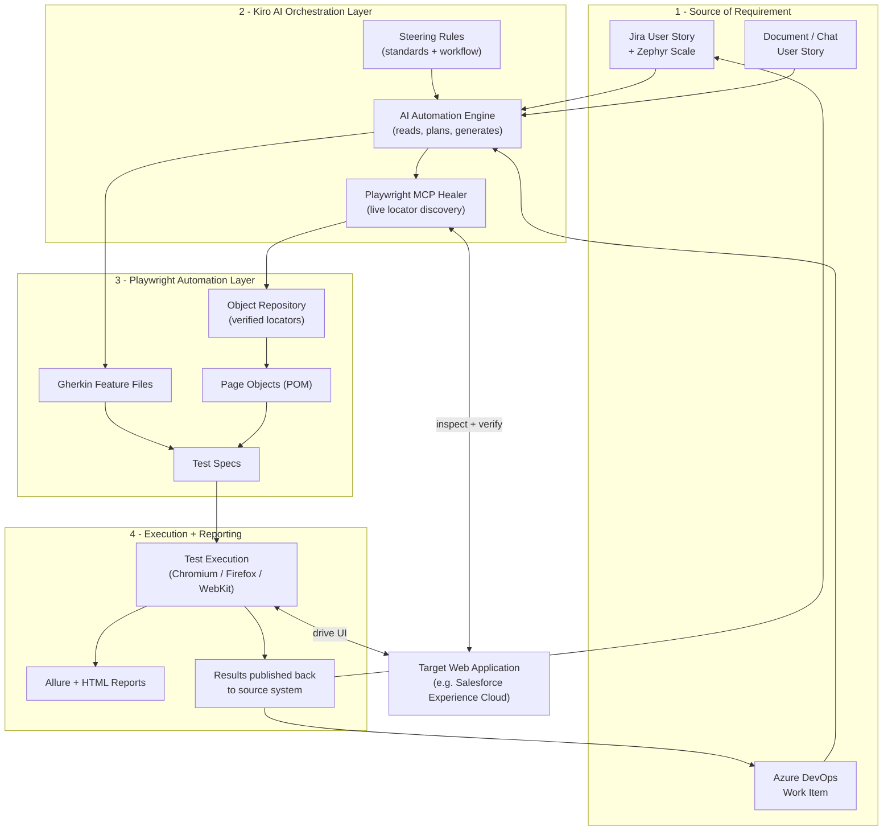
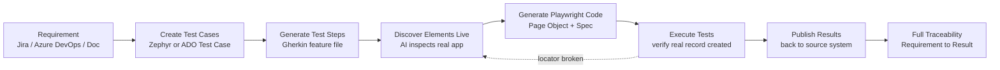
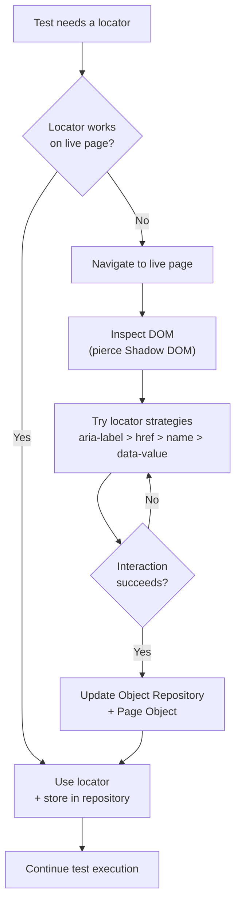
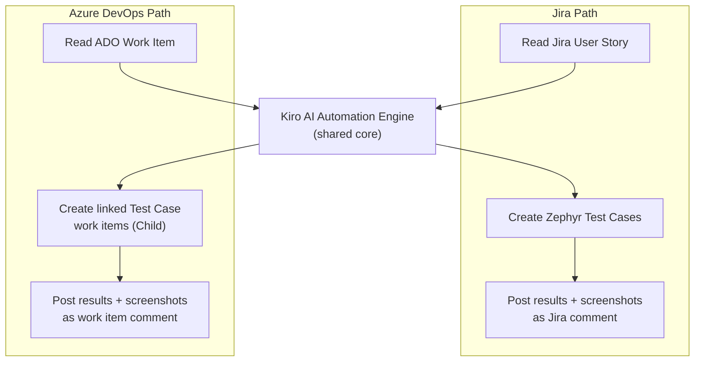
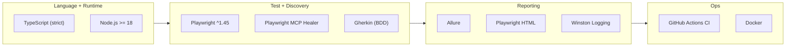

# Architecture Diagrams
## AI-Powered Test Automation Across the Full Lifecycle (Requirement to Result)

**Framework:** Kiro (AI) + Playwright
**Integrations:** Jira + Zephyr Scale · Azure DevOps
**Proven on:** Salesforce Experience Cloud

---

## 1. System Architecture (High-Level)

Four layers work together to turn a requirement into a verified, self-healing automated test.

---

## 2. End-to-End Process (Requirement to Result)

The complete lifecycle the framework automates, from a requirement to a published result.

The dotted line shows **self-healing**: if a locator breaks during execution, the framework re-inspects the live application and repairs itself before continuing.

---

## 3. Self-Healing Locator Flow

The core innovation — locators are discovered and verified against the live application, not guessed.

---

## 4. Dual ALM Integration (Jira and Azure DevOps)

The same automation engine drives two platforms without changes to the core.

---

## 5. Technology Stack (At a Glance)

---

## Diagram Notes

- Diagrams use [Mermaid](https://mermaid.js.org/) and render in GitHub, VS Code (with a Mermaid extension), and most Markdown viewers.
- The **self-healing loop** (Diagram 2 dotted line, Diagram 3) is the key differentiator versus traditional automation.
- The **dual ALM integration** (Diagram 4) shows a single engine serving both Jira/Zephyr and Azure DevOps teams.
